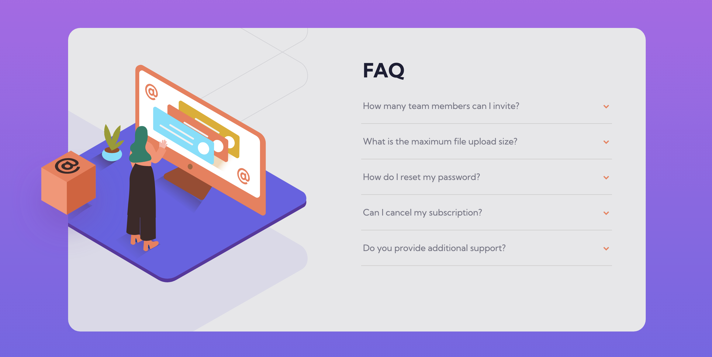
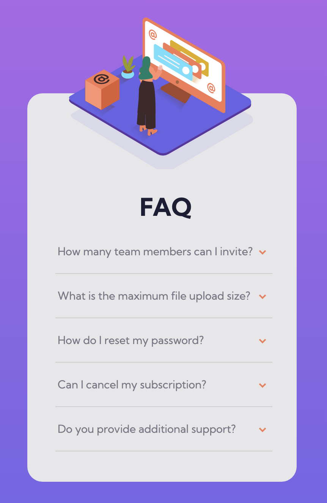

# Frontend Mentor - FAQ accordion card solution

This is a solution to the [FAQ accordion card challenge on Frontend Mentor](https://www.frontendmentor.io/challenges/faq-accordion-card-XlyjD0Oam). Frontend Mentor challenges help you improve your coding skills by building realistic projects. 

## Table of contents

- [Overview](#overview)
  - [The challenge](#the-challenge)
  - [Screenshot](#screenshot)
  - [Links](#links)
- [My process](#my-process)
  - [Built with](#built-with)
  - [What I learned](#what-i-learned)
  - [Continued development](#continued-development)
- [Author](#author)

## Overview

### The challenge

Users should be able to:

- View the optimal layout for the component depending on their device's screen size
- See hover states for all interactive elements on the page
- Hide/Show the answer to a question when the question is clicked

### Screenshot

### Links

- Solution URL: [https://github.com/naomichoe/faq-accordion.git]
- Live Site URL: [https://naomichoe.github.io/faq-accordion/]

## My process

### Built with

- HTML5
- CSS 
- JS

### What I learned

This challenge was good for learning how to create an accordion using JS. It was my first time creating it and found it challenging to add the feature of closing an open accordion when opening a new one.

### Continued development

I would like to continue to learn how to work with accordions using JS. Especially features of opening and closing when opening a new accordion or a close all or open all option.

## Author

- Website - [Naomi Choe](https://github.com/naomichoe/f)
- Frontend Mentor - [@naomichoe](https://www.frontendmentor.io/profile/naomichoe)
